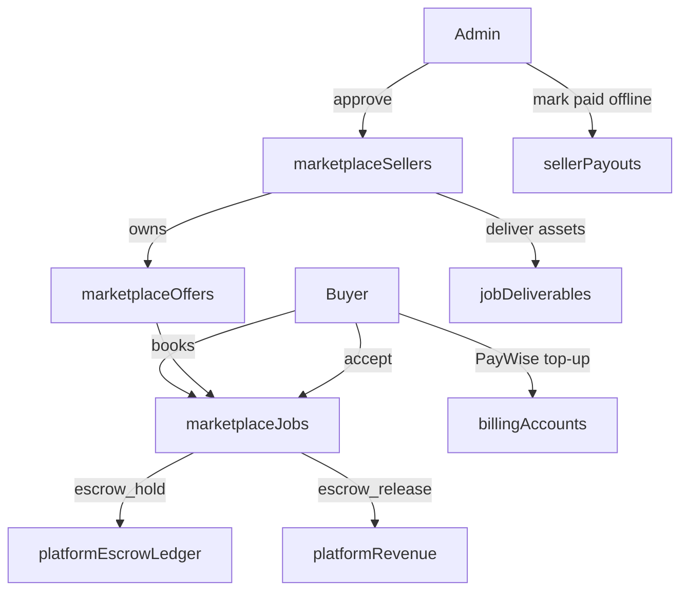

# Studio Marketplace (Offers → Jobs → Escrow)

## Locked decisions

- **Sellers:** admin-approved only (not open to every Studio user).
- **MVP:** full loop — public browse, Offers management tab, book job, escrow hold/release, delivery handoff.
- **Money:** client tops up via existing PayWise → spends credits into **platform escrow** on book → on accepted delivery, escrow becomes **platform revenue**. Yatishara pays creator businesses later (offline); no auto-disbursement to seller wallets.
- **Currency UI:** always show **TTD** (reuse `[src/studio/lib/money.ts](src/studio/lib/money.ts)`); ledger stays in credits.
- **Buyer gate:** Studio account required to book; top-up still required if balance insufficient.
- **Production COGS:** seller spends **their own** generation credits while making the work; package price is separate commerce money.

## Domain model

| Concept           | Meaning                                                                     |
| ----------------- | --------------------------------------------------------------------------- |
| **Offer**         | Public package (title, description, price TTD, category, samples, SLA days) |
| **Job**           | Booked order under an offer (buyer ↔ seller, status machine, escrow amount) |
| **Escrow**        | Credits moved off buyer balance into a platform hold tied to the job        |
| **Delivery**      | Seller attaches Studio `assetId`s (and optional notes); buyer accepts       |
| **Seller payout** | Ops record only — amount owed / marked paid outside Studio                  |

## Money flow (extends existing billing)

Build on `[convex/billing.ts](convex/billing.ts)` / `[billingAccounts](convex/schema.ts)` — do **not** invent a second wallet.

New `creditTransactionKind` values:

- `marketplace_escrow_hold` — debit buyer `creditBalance`, credit platform escrow for `jobId`
- `marketplace_escrow_release` — clear escrow → platform revenue (job completed)
- `marketplace_escrow_refund` — return escrow to buyer (cancel / admin dispute)

Add tables (flat, indexed):

- `marketplaceSellers` — `userId`, `status` (`pendingapprovedsuspended`), `businessName`, `approvedBy`, timestamps
- `marketplaceOffers` — `sellerId`, `title`, `slug`, `description`, `priceCents` (TTD), `priceCredits` (snapshot at publish or compute at book from `pricingSettings`), `category`, `status` (`draftpublishedpausedarchived`), `deliveryDays`, cover/sample asset ids, indexes `by_status_and_published`, `by_seller`
- `marketplaceJobs` — `offerId`, `sellerUserId`, `buyerUserId`, `priceCredits`, `priceCents`, `status`, `escrowCreditTransactionId`, optional `workFolderId`, timestamps; indexes `by_seller`, `by_buyer`, `by_offer`, `by_status`
- `marketplaceJobEvents` — audit trail (status changes, messages)
- `marketplaceDeliverables` — `jobId`, `assetId`, `note`, `deliveredAt`
- `platformEscrowHolds` — `jobId`, `credits`, `status` (`heldreleasedrefunded`)
- `sellerPayouts` — `sellerUserId`, `jobId`, `amountCents`, `status` (`owedpaid`), `paidAt`, `adminNote` (offline payout tracking)

**Job status machine (MVP):**

`pending_payment` → `in_escrow` → `in_progress` → `delivered` → `completed`  
Cancel/refund paths: `cancelled` / `refunded` (admin or pre-delivery cancel).  
**Release trigger:** buyer **Accept**; **auto-accept after 7 days** in `delivered` (scheduled internal mutation). Disputes: admin-only refund while `delivered` (no full dispute UI in MVP).

**Book pricing:** offer stores `priceCents` (TTD). At book, convert with current `creditPriceCents` (50¢ default) → integer credits; reject if buyer balance < price; then hold.

## Auth / access

- Extend `[convex/lib/customFunctions.ts](convex/lib/customFunctions.ts)` with `sellerMutation` / `sellerQuery` (requires approved `marketplaceSellers` row).
- Public queries for published offers (mirror `[convex/profiles.ts](convex/profiles.ts)` public pattern).
- Admin approve/suspend sellers + mark `sellerPayouts` paid.
- Buyers cannot book their own offers; suspended sellers cannot accept new jobs.

## UI surfaces

1. **Public catalog** — new route `[src/app/offers/page.tsx](src/app/offers/page.tsx)` (and `/offers/[slug]` detail). Browse without login; **Book** requires auth → redirect `/?next=/offers/...` then open book flow / top-up if short.
2. **Seller Offers tab** — new tab in `[StudioShell.tsx](src/studio/components/StudioShell.tsx)` (same sticky-tab pattern as Composer). List offers → offer detail → jobs list → job detail (status, deliver, mark complete waiting on buyer).
3. **Buyer job views** — “My jobs” section (same Offers/Jobs area or a Jobs sub-nav): escrow status, download deliverables, Accept.
4. **Admin** — approve sellers, view escrow/revenue, mark offline payouts (minimal admin panel hooks next to existing billing admin).
5. **Profile hook (light)** — optional “Offers” link on public profile when seller approved (`[PublicProfileView.tsx](src/studio/components/PublicProfileView.tsx)`).

Preserve existing top-up UX in StudioShell; on insufficient balance at book, deep-link into that PayWise checkout with required amount.

## Delivery handoff (MVP)

- Seller picks assets from their workspace (existing asset picker patterns) → `marketplaceDeliverables`.
- Buyer gets signed/view URLs (reuse asset media access patterns).
- Optional: on first job `in_progress`, create a seller-owned work folder linked on the job (`workFolderId`) for production organization — not shared multi-tenant folders (Studio remains single-owner).

## Explicit non-goals (this MVP)

- Open seller signup without approval
- In-app PayWise payouts to sellers / seller withdrawable balance
- Client RFP / Upwork-style job posting (buyers post work)
- Split deposits (50/50) — full escrow at book
- Multi-user shared workspaces / org membership
- Messaging thread beyond job event notes

## Implementation order

1. Schema + credit kinds + escrow helpers (tested ledger invariants).
2. Seller approval admin APIs + gate.
3. Offers CRUD + public list/detail queries.
4. Book job + escrow hold + top-up shortfall UX.
5. Job management UI (seller tab + buyer my-jobs).
6. Deliverables + accept + auto-accept cron + revenue release + `sellerPayouts` owed row.
7. Public `/offers` pages + profile link + basic admin payout marking.

## Key reuse

- PayWise path unchanged: `[paywiseActions.ts](convex/paywiseActions.ts)` / `[paywiseHttp.ts](convex/paywiseHttp.ts)`
- TTD helpers: `[money.ts](src/studio/lib/money.ts)`
- Auth wrappers: `[customFunctions.ts](convex/lib/customFunctions.ts)`
- Public page pattern: `[src/app/u/[username]/page.tsx](src/app/u/[username]/page.tsx)`

