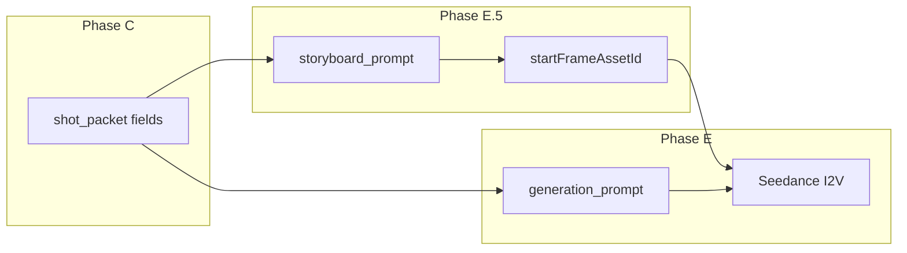

# Seedance 2.0 translation foundation — shot packet → model prompt

**Mandatory read:** director-joe, director-ernesto (merge), dp, orchestrator (Phase E).  
**This is the translation layer** — turns cinema craft into **conditioning text** Seedance actually obeys.

Companion: [camera-grammar-for-gen.md](camera-grammar-for-gen.md) (moves), [seedance-cinematic-look.md](seedance-cinematic-look.md) (look), [start-frame-workflow.md](start-frame-workflow.md) (I2V path).

---

## 1. What Seedance 2.0 is doing (research + API)

| Source | Finding | Studio implication |
|--------|---------|-------------------|
| **ByteDance Seedance 2.0** (Feb 2026) | Unified multimodal audio-video; **director-level** camera/light control via prompt | Prompt = shot brief, not poetry |
| **Practitioner consensus** (Our Code World, fal.ai, Apiyi) | I2V **attention budget ~60–100 words**; longer prompts dilute obedience | **Hard word cap on `generation_prompt`** |
| **Our Code World I2V guide** | Image supplies look; prompt supplies **motion only** | Don't re-describe the frame |
| **fal.ai / ByteDance guidance** | Subject + Motion + Camera + Audio slots | Maps to SCENE + CAMERA + SOUND |
| **UniFuncs API error guide** | `first_frame` + `reference_images` = **two modes**; some APIs forbid mixing | Studio uses `first_frame` + `bytedance.referenceImages` for props only |
| **Replicate readme** | Label refs in prompt: `[Image1]` for appearance lock | Prop sheets attach — name their job in prompt |
| **Pre-text image filter** | Real-person evaluation **before** prompt is read | Wide storyboard framing; no face-sheet video refs |

**Mental model:** Prompts are **config**, not creative writing. Vague adjectives steal attention budget from motion verbs.

---

## 2. Studio pipeline — two prompts, one clip



| Step | Prompt field | Model job | Word budget |
|------|--------------|-----------|-------------|
| **E.5** | `storyboard_prompt` | GPT Image 2 — **full frame specification** | 120–200 words OK |
| **E** | `generation_prompt` | Seedance — **motion from frozen first frame** | **60–100 words strict** |

**Golden rule (I2V):** The start frame holds **who, where, look, layers, light**. The video prompt holds **what moves, how camera travels, what sounds, what must not happen**.

---

## 3. API binding (Yatishara Studio → AI Gateway)

From `convex/lib/aiGateway.ts`:

| Input | Seedance role |
|-------|---------------|
| `startFrameAssetId` → `frameImages.first_frame` | **Frozen opening composition** — people baked in |
| Prop/location `referenceElementIds` → `providerOptions.bytedance.referenceImages` | **Identity lock** for objects/architecture (with start frame) |
| Character sheets | **NOT attached** to video — real-person filter |
| `skipPromptEnhancement: true` | Prompt reaches model **verbatim** — translation must be complete |
| `stylePreset: "story-ad"` | Preset does not replace director merge prose |

**Prompt append:** Studio may append element descriptions to prompt text — director merge must not duplicate sheet details already in refs.

---

## 4. Word budget economics

### Why 60–100 words (I2V)

Practitioner logs (Our Code World, Seedance community guides): beyond ~100 words, Seedance **selectively obeys** — often ignoring camera or constraints.

### Look prefix split (critical fix)

| Field | Look language |
|-------|---------------|
| `storyboard_prompt` | **FULL** prefix from [seedance-cinematic-look.md](seedance-cinematic-look.md) (~55 words) |
| `generation_prompt` | **ABBREVIATED** preservation line (~12 words) — see §6 |

Full Alexa/grain paragraph on I2V **wastes half the budget** re-stating what the start frame already shows.

---

## 5. `storyboard_prompt` — full frame specification (E.5)

**Purpose:** One still that **is** the opening frame. No motion verbs.

### STILL formula

```
[FULL look prefix — seedance-cinematic-look.md]

FRAME: Single still, [aspect ratio]. [Lens], [height], [shot_size_open].
FOREGROUND: [soft layer — one clause, position].
MIDGROUND: [sharp subject — who/what, pose, objects, screen position upper-third].
BACKGROUND: [context — window, room, depth].
LIGHT: [one motivated line — Kelvin, direction, ratio].
PROP LOCK: Match [prop name] from reference sheet — shape, wear, color.
No motion blur. No dolly/pan/track verbs. No on-screen text.
```

### Storyboard rules

| Rule | Why |
|------|-----|
| `shot_size_open` = what's in the image | Push-in shots start **wider** than end size |
| Name **upper-third** placement | Attention research — post-cut gaze |
| Photographic cast: MWS+ only | Pre-text real-person filter |
| All `referenceElementIds` attach | Image gen uses full sheet set |
| Same aspect as delivery | I2V follows input shape |

### Storyboard anti-patterns

| ❌ Vague | ✅ Specific |
|---------|-------------|
| "cinematic kitchen" | "medium wide, worn maple counter MG, honey jar right third, window camera-left BG" |
| "woman looks sad" | "elderly woman seated MG, hands paused above second ceramic mug" |
| "beautiful lighting" | "soft 5600K window key camera-left, 2:1, Rembrandt falloff" |
| "camera pushes in" | *(forbidden — save for generation_prompt)* |

---

## 6. `generation_prompt` — motion specification (E)

### I2V formula (60–100 words)

```
[PRESERVE — abbreviated look, ~12 words]

SCENE: [Subject micro-action verbs only — 1–2 clauses]. [Optional: one secondary motion — hair/cloth/steam].

CAMERA: [shot_size_open]→[shot_size_end], [lens], [height]. ONE [spatial move + speed]. [Parallax FG/MG/BG]. [timing_beats 3 phases]. [Stability line].

SOUND: [diegetic one line — material + silence ms].

CONSTRAINTS: Preserve exact appearance from start frame. Background [static / specified motion only]. No optical zoom. No morphing. No face drift.
```

### Abbreviated PRESERVE line (generation only)

```
Preserve start-frame composition, colors, and motivated light. Documentary film grain, natural skin texture, no AI gloss or morphing.
```

**Do not** repeat full Alexa/Zeiss paragraph on I2V — it's in the start frame already.

### Six slots (maps to research anatomy)

| Slot | generation_prompt section | I2V priority |
|------|---------------------------|--------------|
| 1 Subject action | SCENE clause 1 | **Highest** |
| 2 Secondary motion | SCENE clause 2 | Medium |
| 3 Camera move | CAMERA — ONE move + timing | **Highest** |
| 4 Environment beat | Usually **omit** — frozen in frame | Low |
| 5 Style anchor | PRESERVE line only | Low |
| 6 Negative constraint | CONSTRAINTS + stability | High |

### Spatial camera verbs Seedance reads cleanly

Use from [camera-grammar-for-gen.md](camera-grammar-for-gen.md):

- `slow dolly forward through space toward [subject]`
- `slow lateral tracking shot — camera travels left through the room`
- `locked-off tripod, static camera` (explicit static)
- `slow dolly backward revealing [environment]`

**Never:** zoom, epic cinematic, dynamic camera, pan across room (prefer track).

### Timing beats (required when move ≠ locked)

```
0.0–0.6s locked settle.
0.6–3.2s slow dolly forward through kitchen — FG counter edge slides faster, BG window slower.
3.2–4.0s breathe hold on end framing.
```

Align to [shot-sequence-grammar.md](shot-sequence-grammar.md) settle-travel-breathe.

### Micro-pacing → CAMERA (mandatory)

Read [micro-pacing-foundation.md](micro-pacing-foundation.md). **`duration_sec` (editorial) drives timing_beats**, not default 4s gen length.

| `rhythm.role_in_scene` | Editorial `duration_sec` | CAMERA timing language |
|------------------------|--------------------------|------------------------|
| `opener_anchor` | ≥2.5s | Full settle-travel-breathe; slow dolly; end with `Editorial X.Xs` |
| `staccato_beat` | ≤1.5s | `locked-off`; travel ≤0.4s; `Trim to {duration_sec}s editorial` in CONSTRAINTS |
| `punch_beat` | ≤1.5s | Locked or short track; match-action peak at cut |
| `deceleration_hold` | ≥2.5s | `slow-motion weighted hold`; extended breathe; minimal travel |
| `acceleration_beat` | 1.5–2s | Short track; reduced settle |

**Director merge** must copy editor `duration_sec` into CAMERA closing clause: `Editorial {N.N}s.`

**Scrutiny:** editorial 1s + 2.5s dolly travel = **blocking**.

### Reference binding (when prop sheets attach)

```
Match honey jar ceramic shape and amber label from reference image — hold exact prop identity.
```

One clause — refs are hard constraints via `referenceImages`, prompt labels the job.

---

## 7. Field mapping — shot_packet → prompt text

| shot_packet field | storyboard_prompt | generation_prompt |
|-------------------|-------------------|-------------------|
| `camera.shot_size_open` | FRAME size | CAMERA open |
| `camera.shot_size_end` | — | CAMERA end |
| `camera.lens` | FRAME | CAMERA |
| `camera.height` / `angle` | FRAME | CAMERA |
| `camera.depth_layers.*` | FG/MG/BG clauses | SCENE one-line + parallax |
| `camera.layer_device` | FOREGROUND | parallax note |
| `camera.movement` | **forbidden** | CAMERA move phrase |
| `camera.timing_beats` | **forbidden** | CAMERA timing |
| `camera.parallax_note` | — | CAMERA |
| `action` | MIDGROUND pose | SCENE verbs |
| `lighting.*` | LIGHT line | **omit** (in frame) or 3 words in PRESERVE |
| `sound.primary_sound` | — | SOUND |
| `sound.silence_beats` | — | SOUND |
| `color.grade` | LIGHT/color | omit |
| `continuity_locks` | PROP LOCK | CONSTRAINTS |
| `emotional_temperature` | **never label emotion** | translate to verbs/silence |
| `rhythm.role_in_scene` | — | CAMERA timing scale + locked vs travel |
| `rhythm.perceived_pace_register` | — | staccato → locked; legato → slow dolly |

---

## 8. Worked example — witness mug beat (4s I2V)

### storyboard_prompt (~140 words)

```
Seedance 2.0 cinematic. Shot on ARRI Alexa with Zeiss Supreme primes. Natural film grain visible in midtones. Motivated practical window light only — no beauty dish, no catalog gloss. Real human skin texture, subtle pores, no AI smoothing. Documentary Caribbean domestic realism — filmed not generated, not illustrated, not animated.

FRAME: Single still, 9:16. 50mm eye-level medium wide.
FOREGROUND: Soft out-of-focus mug rim lower left.
MIDGROUND: Caregiver hands paused above second empty ceramic mug on worn wooden counter, upper-left third, sharp focus.
BACKGROUND: Kitchen window soft depth, morning exterior blur.
LIGHT: Soft 5600K window key camera-left, 2:1 Rembrandt, warm bounce fill.
PROP LOCK: Honey jar amber glass and label match reference sheet on counter right third.
No motion blur. No travel verbs. No on-screen text.
```

### generation_prompt (~85 words)

```
Preserve start-frame composition, colors, and motivated light. Documentary film grain, natural skin texture, no AI gloss or morphing.

SCENE: Hands pause mid-reach above second mug; subtle cotton sleeve shift. Steam wisps rise slowly from nearer mug.

CAMERA: medium wide→medium on hands. 50mm eye-level. 0.0–0.6s locked settle. 0.6–3.2s slow dolly forward through kitchen toward mugs — FG rim slides faster, BG window slower. 3.2–4.0s breathe hold. Stable gimbal through space; no optical zoom, no pan, no morphing.

SOUND: Soft ceramic contact implied; 0.8s near-silence after pause; no score.

CONSTRAINTS: Preserve exact appearance from start frame. Honey jar identity locked to reference. Background static except steam.
```

---

## 9. Vague → precise translation table

| Vague (burns budget, weak signal) | Precise (Seedance obeys) |
|-----------------------------------|--------------------------|
| "cinematic shot" | "50mm eye-level medium wide, slow dolly forward through room" |
| "emotional moment" | "hands stop before second mug; 1.0s near-silence" |
| "camera moves closer" | "slow dolly forward through space toward counter, 2.5s travel" |
| "beautiful kitchen" | *(storyboard only)* "worn maple counter, honey jar right third" |
| "sad atmosphere" | **forbidden** — use pause + silence + unfinished ritual action |
| "epic / stunning / dramatic" | delete — zero motion signal |
| "zoom in" | **blocking** — use `slow dolly forward` |
| "pan across room" | `slow lateral tracking shot through room` |
| "camera follows action" | `slow tracking shot forward following hands at walking pace` |

---

## 10. Failure debug matrix

| Symptom | Likely cause | Fix |
|---------|--------------|-----|
| Ignores camera move | Prompt >100 words or two moves | Cut words; one move; timing beats |
| Flat 2D zoom feel | Used zoom/pan not dolly | Rewrite CAMERA with spatial travel + parallax |
| Character morphs | Face too prominent; no preserve line | Widen storyboard; add CONSTRAINTS preserve |
| Pre-gen rejection | Real-person filter on image | [start-frame-workflow.md](start-frame-workflow.md); Kling fallback |
| Prop shape drifts | Ref not named in prompt | PROP LOCK clause + referenceElementIds |
| Everything moves | No freeze constraint | "Background static except [one element]" |
| Glossy AI skin | Look only in video prompt | Full look on storyboard; abbreviated on video |
| Wrong aspect | Storyboard ratio ≠ brief | Regen E.5 with correct aspectRatio |
| Chaotic motion | Subject + camera both complex | Simplify SCENE to one verb; slow camera |

---

## 11. Director merge translation checklist

Before Phase C sign-off **per shot**:

- [ ] `storyboard_prompt` has FRAME / FG / MG / BG / LIGHT — **no motion verbs**
- [ ] `generation_prompt` ≤100 words (count after merge)
- [ ] `generation_prompt` has **SCENE:** and **CAMERA:** headers
- [ ] Full look prefix on storyboard only; abbreviated PRESERVE on video
- [ ] Exactly **one** spatial camera move (or explicit locked-off)
- [ ] `timing_beats` present when move ≠ locked
- [ ] Stability line present: no optical zoom, no morphing
- [ ] No emotion adjectives; observable verbs only
- [ ] `shot_size_open` on storyboard matches push/pull start position
- [ ] Prop reference named if `referenceElementIds` includes prop
- [ ] Sound: diegetic + silence duration if beat requires

---

## 12. Text-to-video vs I2V (when no cast)

If `cast_on_camera: false` and no `startFrameAssetId`:

- May use **full** look prefix in `generation_prompt` (no start frame duplication issue)
- Still keep **60–100 words** and SCENE/CAMERA split
- Prop/location refs may use reference-only mode without first_frame

---

## 13. Research & doc references

| ID | Source |
|----|--------|
| `research:seedance-i2v-budget` | 60–100 word practitioner consensus |
| `research:seedance-motion-not-subject` | Our Code World I2V guide |
| `research:seedance-prompt-formula` | fal.ai / ByteDance subject+motion+camera+audio |
| `research:seedance-api-modes` | first_frame vs reference_images mutual exclusion |
| `research:seedance-preimage-filter` | Real-person evaluation before prompt |

External:
- [ByteDance Seedance 2.0](https://seed.bytedance.com/en/seedance2_0)
- [Our Code World I2V guide](https://ourcodeworld.com/articles/read/3199/a-developer-s-guide-to-writing-image-to-video-prompts-for-seedance-2-0)
- [fal.ai prompting guide](https://fal.ai/learn/tools/seedance-2-0-prompting-guide)
- [DataCamp API tutorial](https://www.datacamp.com/tutorial/seedance-2-0-api-guide) — first_frame / last_frame roles

---

## Related

- [research-canon-map.md](research-canon-map.md)
- [depth-and-layering-for-gen.md](depth-and-layering-for-gen.md)
- [attention-foundation.md](attention-foundation.md) — upper-third placement
- [studio-handoff.md](studio-handoff.md) — MCP calls
