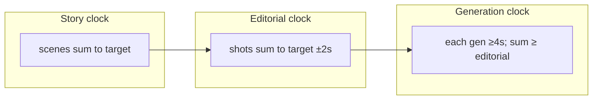

# Timing foundation — duration planning across all crafts

**Mandatory read:** story-architect (Phase A), editor (Phase C first), directors (merge), dp, gaffer, sound-designer, toon-translator (scrutiny).

Purpose: Agents must not plan a **15s social spot** like a **90s brand film** — or vice versa. This doc defines **three clocks**, **duration tiers**, and **cross-channel timing budgets** so story, shots, movement, light, and sound stay coherent.

Companion: [storytelling-foundation.md](storytelling-foundation.md) (peak-end), [shot-sequence-grammar.md](shot-sequence-grammar.md) (energy curve), [micro-pacing-foundation.md](micro-pacing-foundation.md) (**shot rhythm within scenes**), [camera-grammar-for-gen.md](camera-grammar-for-gen.md) (travel in 4s gens), [sound-foundation.md](sound-foundation.md) (silence ms).

---

## 1. Three clocks (never confuse them)

| Clock | Owner | Unit | What it measures |
|-------|-------|------|------------------|
| **Story clock** | story-architect | scene `duration_sec` | Narrative beats, inference, peak-end placement |
| **Editorial clock** | editor | shot `duration_sec` | Cut rhythm, energy curve, platform pacing |
| **Generation clock** | editor + dp | `generation_duration_sec` | Seedance clip length (min **4s**); trim in post |



**Golden rules:**

1. `sum(scenes.duration_sec)` = brief target **±2s**
2. `sum(shots.duration_sec)` = brief target **±2s**
3. `sum(shots.generation_duration_sec)` ≥ editorial sum (trim surplus in post)
4. Every shot with motion: `timing_beats` fit inside **`generation_duration_sec`**, not `duration_sec` alone

**Common failure:** 8 shots × 6s editorial planned in a **30s** brief (48s). **Common failure:** 4s travel move scripted in a **2.5s** editorial insert.

---

## 2. Duration tiers — master budget table

Use at **Phase 0 intake** and **Phase A** before writing scenes. At **Phase C**, editor must match tier shot/scene budgets.

| Tier | Label | Scenes | Shots | Locations | Cast (speaking-age) | Inferential beats | Gen clips (min) | Peak position | End anchor |
|------|-------|--------|-------|-----------|---------------------|-------------------|-----------------|---------------|------------|
| **15s** | social_punch | **1** | **3–5** | **1** | **0–1** | **3–4** | 3–5 | ~40–50% (~6–8s) | final **2–3s** |
| **30s** | social_standard | **1–2** | **5–7** | **1–2** | **0–1** | **6–8** | 5–7 | ~45–55% (~14–17s) | final **3–4s** |
| **60s** | broadcast_short | **3–4** | **8–12** | **2** | **1–2** | **12–15** | 8–12 | ~55–65% (~33–39s) | final **5–8s** |
| **90s** | brand_standard | **4–6** | **10–18** | **2–3** | **1–3** | **15–22** | 10–18 | ~60–70% (~54–63s) | final **6–10s** |
| **180s** | long_form | **6–8** | **16–24** | **3–4** | **2–4** | **28–40** | 16–24 | ~65–75% | final **10–15s** |

**Joe vs Ernesto within tier:** Ernesto needs **longer turn + relief** — steal 3–5s from establish segment, not from end anchor.

**Scrutiny blocking:** scene count or shot count **>150%** of tier max without director compromise. **Scrutiny blocking:** 15s brief with 3+ scenes.

---

## 3. Story clock — scene timing by tier

### 15s — one scene, one proof

| Segment | % | Seconds | Joe content | Ernesto content |
|---------|---|---------|-------------|-----------------|
| Hook | 0–25% | 0–4s | Object + geography in one frame | Friction visible immediately |
| Proof | 25–70% | 4–10s | **One** observable behavior | Pressure → micro turn |
| Peak | 40–55% | 6–8s | Witness pause / hands stop | Behavior shift |
| End anchor | 70–100% | 10–15s | Truth line or object hold | Relief proof + CTA |

**No** time-passage montage. **No** second location. Narrator: **0–1 line** at end only.

### 30s — hook + turn + close

| Segment | Seconds | Notes |
|---------|---------|-------|
| Hook + establish | 0–8s | 1–2 shots worth of story |
| Friction / proof | 8–20s | Main inference chain |
| Peak | 12–18s | Single strongest beat |
| End anchor | 22–30s | Silence + revelation |

2 scenes max: e.g. SC01 kitchen (20s) + SC02 same space time-skip (10s) **or** single continuous scene.

### 60s — compressed arc

See [../specialists/story-architect/references/beat-structures.md](../specialists/story-architect/references/beat-structures.md). 3–4 scenes. One inferential beat per **4–6s** screen time.

### 90s — standard Joe 7-beat

SC01 12s → SC02 18s → SC03 18s → SC04 18s → SC05 15s → SC06 9s. Peak in SC04–SC05.

### 180s — expanded

8 scenes minimum 8s each. Allow **two** time-passage beats. Minimum **4s** per observable action.

### Story timing formula

```
max_inferential_beats ≈ floor(duration_sec / 4)
max_scenes ≈ tier table above
min_end_anchor_sec = tier end_anchor column (use upper bound for Joe witness holds)
```

---

## 4. Editorial clock — shot timing by tier

### Average shot length (ASL) targets

| Tier | ASL target | Range per shot | Rationale |
|------|------------|----------------|-----------|
| 15s | **3.0–3.5s** | 2–5s | Social attention decay ~3s |
| 30s | **4.0–4.5s** | 2.5–6s | One beat per shot |
| 60s | **5.0–6.0s** | 2–8s | Room for breathe holds |
| 90s | **5.0–7.0s** | 2–10s | MS masters can hold |
| 180s | **7.0–9.0s** | 3–12s | Longer observation |

**Formula:** `shot_count ≈ duration_sec / ASL` (round to tier min–max).

### Shot role durations (editorial `duration_sec`)

| Shot role | 15s | 30s | 60s+ |
|-----------|-----|-----|------|
| Hook / geography | 2–3s | 3–4s | 4–6s |
| Insert / detail | 1.5–2.5s | 2–3s | 2–4s |
| Behavior beat | 3–4s | 4–5s | 4–6s |
| Quiet hold / witness | 2–3s | 3–4s | 4–6s |
| End anchor | 2–3s | 3–5s | 5–10s |
| Time-passage wide | **forbidden** | 4s (max 1) | 4–6s |

### Energy curve compression by tier

| Tier | Curve segments (minimum) |
|------|--------------------------|
| 15s | `hook → peak → end_anchor` (3 segments) |
| 30s | `hook → friction → peak → end_anchor` |
| 60s+ | Full Joe curve per [shot-sequence-grammar.md](shot-sequence-grammar.md) |

---

## 5. Generation clock — Seedance 4s constraint

Studio video **minimum 4 seconds**. Editorial trims can be shorter; generation cannot.

| Editorial need | `generation_duration_sec` | `editorial_trim_sec` |
|----------------|---------------------------|----------------------|
| 2s insert | **4** | 2.0 |
| 3.5s behavior | **4** | 3.5 |
| 5s hold | **5** or **6** | 5.0 |
| 8s master | **8** (two 4s gens stitched in post) or **6** + trim | 8.0 |

**15s spot math:** 4 shots × 4s gen = **16s** raw → trim **1s** across cuts to hit 15s. Budget **4 generate_video calls**, not 8.

**Cost rule:** `estimated_video_gens ≈ shot_count` (one gen per shot unless stitched strategy documented).

### Settle — travel — breathe vs clip length

Per [shot-sequence-grammar.md](shot-sequence-grammar.md), scaled to `generation_duration_sec`:

| Gen length | Settle | Travel | Breathe |
|------------|--------|--------|---------|
| **4s** | 0.0–0.6s | 0.6–3.2s | 3.2–4.0s |
| **5s** | 0.0–0.7s | 0.7–4.0s | 4.0–5.0s |
| **6s** | 0.0–0.8s | 0.8–5.0s | 5.0–6.0s |

**Scrutiny blocking:** travel phase **longer than** `generation_duration_sec − 1.0s`. **Scrutiny blocking:** `timing_beats` reference times **beyond** gen duration.

### Movement speed by tier

| Tier | Default move speed | Max travel in 4s gen |
|------|-------------------|----------------------|
| 15s | **slow** only | One short dolly or locked |
| 30s | slow | One dolly **or** short track |
| 60s+ | slow; medium on Ernesto turn | Full settle-travel-breathe |

15s: prefer **`locked`** or **`push-in-slow`** with **≤2.5s** travel. No orbit. No handheld on social vertical.

---

## 6. Lighting timing — diegetic time, not clip length

Lighting does not animate per second in gen — but **story time** advances across scenes.

| Story elapsed | Light shift | Pipeline field |
|---------------|-------------|----------------|
| Same scene | **Locked** Kelvin + direction | `continuity_locks` |
| Morning → afternoon (60s+) | +500–800K warmer, harder shadow | new scene `weather_time` |
| Time-passage beat | Same window direction, **new hands/wardrobe** | graphic match cut |
| 15–30s single scene | **One** Kelvin throughout | blocking if gaffer shifts ratio mid-scene |

**15s/30s rule:** one `color_temp_k` and one `key_fill_ratio` for entire spot unless brief explicitly says time-lapse.

**Peak-end lighting:** peak beat may add **+1 stop contrast** or tighter ratio; end anchor returns to **softer 2:1** — same sources, calmer falloff language in LIGHT line.

---

## 7. Sound timing — ms budgets by tier

Sound is the **finest** timing grid. Align to camera settle/breathe per [sound-foundation.md](sound-foundation.md).

| Tier | Foreground SFX per shot | Silence budget | Bed density |
|------|-------------------------|----------------|-----------|
| 15s | **1** transient max | **400–800ms** pre-peak | sparse |
| 30s | 1–2 | 600–1000ms on witness | sparse |
| 60s+ | 1–2 | up to 1200ms on peak-end | medium sparse |

**15s rule:** one **sonic punctuation** before end anchor; **≥0.5s** near-silence into final frame.

**Generation_prompt SOUND line:** state silence in **milliseconds** — `0.6s near-silence after ceramic contact`.

**Scrutiny blocking:** two equal-weight transients in one **15s** shot. **Scrutiny blocking:** cut before `silence_beats` completes on end anchor shot.

---

## 8. Cross-channel timing matrix (Phase C merge)

Director verifies per shot:

| Channel | Question | Tier-sensitive |
|---------|----------|----------------|
| Story | Does this shot earn its **scene** seconds? | 15s: every shot = essential |
| Editor | `duration_sec` matches ASL tier? | ASL table §4 |
| DP | Travel fits **gen** duration? | §5 scale table |
| Gaffer | Light matches **story time** not clip fudge? | §6 |
| Sound | Silence fits **breathe** phase? | §7 |
| Seedance | `timing_beats` ⊆ `generation_duration_sec`? | translator scrutiny |

---

## 9. Phase ownership — who plans timing when

| Phase | Role | Timing deliverable |
|-------|------|-------------------|
| **0** | orchestrator | `duration_sec` in planning-intake; pick tier from table §2 |
| **A** | story-architect | Scene `duration_sec` sums; `peak_beat` + `end_anchor` **positions** per tier % |
| **A scrutiny** | production-designer | Location count vs tier |
| **B** | location-scout | Location count cap |
| **C first** | editor | Shot list durations, `generation_duration_sec`, sequence map, ASL check |
| **C** | dp | `timing_beats` scaled to gen duration |
| **C** | sound | `silence_beats` ms aligned to breathe |
| **C scrutiny** | toon-translator | Beat times ≤ gen duration |
| **E** | orchestrator | `durationSeconds: generation_duration_sec`; ≥65s between calls |

---

## 10. Planning intake — duration selection guide

Ask user or infer:

| If brief says… | Tier | Warn if… |
|----------------|------|----------|
| "TikTok / Reels / bumper" | 15s | >5 shots planned |
| "Social / feed ad" | 15–30s | multiple locations |
| "YouTube pre-roll skippable" | 15–30s | narrator >2 lines |
| "TV / broadcast spot" | 30–60s | no end anchor hold |
| "Brand film / manifesto" | 60–90s | <8 shots |
| "Long form / cinema ad" | 90–180s | — |

**Do not default to 60s** when user says "short ad."

---

## 11. Sequence map timing fields (editor output)

Add to editor Phase C sequence map:

```json
{
  "duration_tier": "30s_social_standard",
  "target_duration_sec": 30,
  "planned_asl_sec": 4.2,
  "shot_count": 6,
  "generation_clip_count": 6,
  "raw_generation_sec": 24,
  "editorial_trim_budget_sec": 0,
  "peak_position_sec": 16,
  "end_anchor_start_sec": 24,
  "timing_warnings": []
}
```

---

## 12. Common timing failures (scrutiny blockers)

| Failure | Example | Fix |
|---------|---------|-----|
| **Duration drift** | Shots sum 94s on 90s brief | Rebalance shot `duration_sec` |
| **Tier overflow** | 12 shots on 15s | Cut to 3–5; merge beats |
| **Scene sprawl** | 4 scenes on 30s | Collapse to 1–2 |
| **Gen underbudget** | 4s travel in 4s gen with 0.6s settle + 0.8s breathe | Shorten travel or extend gen to 5s |
| **Peak too early** | Peak at 5s on 60s | Move to 33–39s band |
| **No end hold** | CTA cut at 58.5s on 60s | Reserve 5s end anchor |
| **ASL panic** | All shots 2s on 90s | Add 4–6s masters |
| **Inference flood** | 30 beats on 30s | Max 8 inferential moments |
| **Light time drift** | Window left morning, right evening same scene | Lock window_direction |
| **Sonic pile-up** | 3 foley events in 3s insert | One foreground stream |

---

## 13. Research basis (summary)

| Principle | Source | Timing implication |
|-----------|--------|-------------------|
| **Duration neglect** | Kahneman peak-end | End anchor seconds matter more than middle padding |
| **Attention decay** | Social platform studies (~3s hook) | 15s ASL ~3s; hook in first 25% |
| **AToCC** | Cutting rhythm | Cut after breathe; settle on next shot |
| **Murch Rule of Six** | Emotion > rhythm | Sacrifice continuity for silence hold on peak-end |
| **Chion synchresis** | Sound tied to visible event | SFX ms align to travel phase |
| **Seedance I2V** | 4s minimum clip | Generation clock ≥ editorial need |

---

## 14. Checklist before Phase C parallel builds

- [ ] `duration_tier` identified from §2
- [ ] Scene durations sum to target ±2s
- [ ] Shot count within tier min–max
- [ ] Location count within tier cap
- [ ] Peak beat position within tier % band
- [ ] End anchor duration ≥ tier minimum
- [ ] Each shot has `duration_sec` + `generation_duration_sec` ≥ 4
- [ ] ASL within tier target ±1s
- [ ] `generation_clip_count` = shot count (document exceptions)

---

## Related

- [../specialists/story-architect/references/beat-structures.md](../specialists/story-architect/references/beat-structures.md)
- [../specialists/editor/references/pacing.md](../specialists/editor/references/pacing.md)
- [shot-sequence-grammar.md](shot-sequence-grammar.md)
- [planning-intake.md](planning-intake.md)
